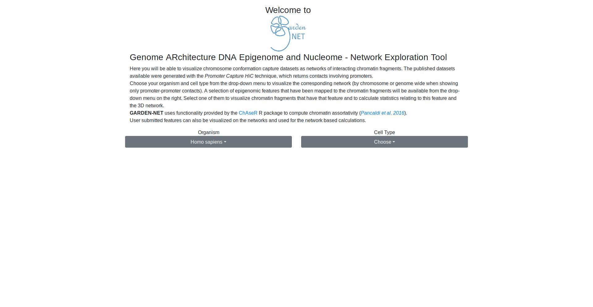
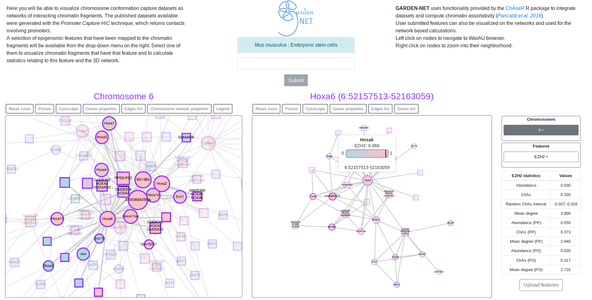

<h3><p align="center">
  Welcome to
</p></h3>
<p align="center">
  <a href="https://github.com/VeraPancaldiLab/GARDEN-NET" target="_blank">
  
  </a>
</p>
<h3>
<p align="center">
  Genome ARchitecture DNA Epigenome and Nucleome
</p>
</h3>
<h3>
<p align="center">
-
</p>
<h3>
<p align="center">
Network Exploration Tool
</p>
</h3>
<p align="center">
  Dear users,
</p>
<p align="center">
  <b>
  Due to scheduled annual electrical maintenance GARDEN-NET will be unavailable
  </b>
</p>
<p align="center">
  From
  Monday, August 3th 15:00h
  to
  Tuesday, August 4th, 20:00h
</p>
<p align="center">
  We apologize for the inconveniences this may cause.
</p>
  <span>
  Here you will be able to visualize chromosome conformation capture datasets as networks of interacting chromatin fragments. The published datasets available were generated with the <em>Promoter Capture HiC</em> technique, which returns contacts involving promoters.
  </span>
  <br />
  Choose your organism and cell type from the drop-down menu to visualize the corresponding network (by chromosome or genome wide when showing only promoter-promoter contacts). A selection of epigenomic features that have been mapped to the chromatin fragments will be available from the drop-down menu on the right. Select one of them to visualize chromatin fragments that have that feature and to calculate statistics relating to this feature and the 3D network.
  <br />
  <br />
  <span>
  <b>GARDEN-NET</b> uses functionality provided by the <a href="https://bitbucket.org/eraineri/chaser" target="_blank">ChAseR</a> R package to compute chromatin assortativity (<em><a href="https://genomebiology.biomedcentral.com/articles/10.1186/s13059-016-1003-3" target="_blank">Pancaldi et al. 2016</a></em>).
  </span>
  <br />
  User submitted features can also be visualized on the networks and used for the network based calculations.


[](https://pancaldi.bsc.es/garden-net)
[](https://pancaldi.bsc.es/garden-net)

# Table Of Content

<details>
<summary>Click to expand Table Of Content</summary>
<ul>
    <li><a href="#table-of-content">Table Of Content</a></li>
    <li><a href="#backend">Backend</a></li>
    <li><a href="#requirements">Requirements</a><ul>
      <li><a href="#packages">Packages</a></li>
      <li><a href="#dependencies">Dependencies</a></li>
    </ul></li>
    <li><a href="#usage">Usage</a></li>
    <li><a href="#development">Development</a><ul>
      <li><a href="#testing">Testing</a></li>
      <li><a href="#build">Build</a></li>
      <li><a href="#serve">Serve</a></li>
    </ul></li>
    <li><a href="#production">Production</a><ul>
        <li><a href="#bundler-with-excluded-dependencies">Bundler with excluded dependencies</a></li>
      </ul></li>
      <li><a href="#dist">Dist</a></li>
    </ul></li>
    <li><a href="#deployment">Deployment</a></li>
    <li><a href="#technologies">Technologies</a></li>
    <li><a href="#license">License</a></li>
    <li><a href="#contributors">Contributors</a></li>
  </ul></li>
</ul>
</details>

## Backend
The backend add to GARDEN-NET the search, neighborhood, and upload features files capacities provided by [GARDEN-NET_backend](https://github.com/VeraPancaldiLab/GARDEN-NET_backend)

## Requirements

### Packages
- `yarn`

### Dependencies
`yarn install`

## Usage
1. Run `yarn serve`
2. Open public/**index.html** or public/**production.html** with any web browser, for example, [Firefox](https://www.mozilla.org/)

## Development

### Testing
`yarn test`

### Build
`yarn build`

### Serve
`yarn serve`

## Production
**React**, **React-DOM**, **Reactstrap** and **Cytoscape** dependencies are excluded by default from the bundle a cause of their size

Use **production.html** which replaces the next lines from the index.html
```html
<link rel="stylesheet" type="text/css" href="./node_modules/bootstrap/dist/css/bootstrap.min.css">
<link rel="stylesheet" type="text/css" href="../node_modules/tippy.js/themes/light-border.css">

<script src="../node_modules/react/umd/react.development.js"></script>
<script src="../node_modules/react-dom/umd/react-dom.development.js"></script>
<script src="../node_modules/reactstrap/dist/reactstrap.full.js"></script>
<script src="../node_modules/cytoscape/dist/cytoscape.min.js"></script>
<script src="../node_modules/redux/dist/redux.js"></script>
<script src="../node_modules/react-redux/dist/react-redux.js"></script>
<script src="../node_modules/popper.js/dist/umd/popper.js"></script>
<script src="../node_modules/cytoscape-popper/cytoscape-popper.js"></script>
<script src="../node_modules/tippy.js/umd/index.js"></script>
<script src="../node_modules/react-router-dom/umd/react-router-dom.js"></script>
```

with CDN links for production (min versions)

```html
<link rel="stylesheet" type="text/css" href="https://unpkg.com/bootstrap/dist/css/bootstrap.min.css">
<link rel="stylesheet" type="text/css" href="https://unpkg.com/tippy.js/themes/light-border.css">

<script src="https://unpkg.com/react/umd/react.production.min.js"></script>
<script src="https://unpkg.com/react-dom/umd/react-dom.production.min.js"></script>
<script src="https://unpkg.com/reactstrap/dist/reactstrap.full.min.js"></script>
<script src="https://unpkg.com/cytoscape/dist/cytoscape.min.js"></script>
<script src="https://unpkg.com/redux/dist/redux.min.js"></script>
<script src="https://unpkg.com/react-redux/dist/react-redux.min.js"></script>
<script src="https://unpkg.com/popper.js/dist/umd/popper.min.js"></script>
<script src="https://unpkg.com/cytoscape-popper/cytoscape-popper.js"></script>
<script src="https://unpkg.com/tippy.js/umd/index.min.js"></script>
<script src="https://unpkg.com/react-router-dom/umd/react-router-dom.min.js"></script>
```

#### Bundler with excluded dependencies
Comment/Remove the next lines from the **webpack.config.js** file (the bundle file will be increased a lot)
```js
externals: {
  "react": "React",
  "react-dom": "ReactDOM",
  "reactstrap": "Reactstrap",
  "cytoscape": "cytoscape",
  "redux": "Redux",
  "react-redux": "ReactRedux",
  "popper.js": "Popper",
  "cytoscape-popper": 'cytoscapePopper',
  "react-redux": "ReactRedux",
  "react-router-dom": "ReactRouterDOM"
}
```
and run [Dist](#dist)

### Dist
`yarn dist`

## Deployment
`
docker run --rm --interactive --tty --publish 8080:8080 --user "$(id -u):$(id -g)" --volume "$(pwd):/GARDEN-NET" --workdir /GARDEN-NET node:8-alpine sh -c 'yarn install && yarn build:no-watch && yarn dist && yarn serve'
`

or run

`./docker.sh`

## Technologies
- [Yarn](https://yarnpkg.com/en/)
- [Webpack](https://webpack.js.org/)
- [TypeScript](https://www.typescriptlang.org/)
- [React](https://reactjs.org/)
- [Redux](https://redux.js.org/)
    - [react-redux](https://github.com/reduxjs/react-redux)
- [Bootstrap](https://getbootstrap.com/)
    - [Reactstrap](https://reactstrap.github.io/)
- [Cytoscape.js](http://js.cytoscape.org/)
    - [Cytoscape.js-popper](https://github.com/cytoscape/cytoscape.js-popper)
- [jest](https://jestjs.io/)
- [tippy.js](https://atomiks.github.io/tippyjs/)

## License
GNU AFFERO GENERAL PUBLIC LICENSE (see [License.md](./License.md))

## Contributors
- Miguel Madrid Mencía ([mimame](https://github.com/mimame)) - creator, maintainer
