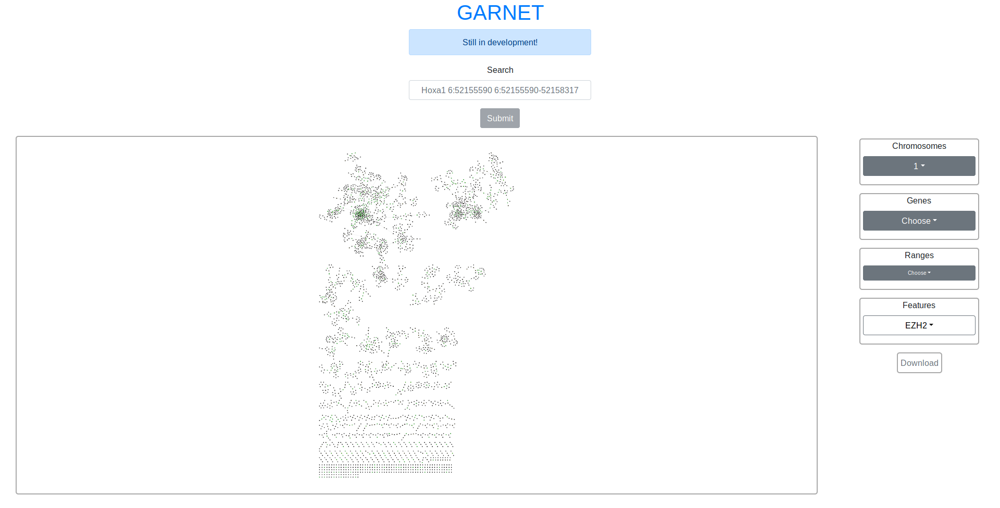

# [ChAs Frontend](https://verapancaldilab.github.io/ChAs_Frontend/)
**[Website](https://verapancaldilab.github.io/ChAs_Frontend/)**

<https://verapancaldilab.github.io/ChAs_Frontend/>



# Table Of Content

<details>
<summary>Click to expand Table Of Content</summary>
<ul>
  <li><a href="#chas-frontend">ChAs Frontend</a><ul>
    <li><a href="#table-of-content">Table Of Content</a></li>
    <li><a href="#description">Description</a></li>
    <li><a href="#requirements">Requirements</a><ul>
      <li><a href="#packages">Packages</a></li>
      <li><a href="#dependencies">Dependencies</a></li>
    </ul></li>
    <li><a href="#usage">Usage</a></li>
    <li><a href="#development">Development</a><ul>
      <li><a href="#testing">Testing</a></li>
      <li><a href="#build">Build</a></li>
      <li><a href="#serve">Serve</a></li>
    </ul></li>
    <li><a href="#production">Production</a><ul>
        <li><a href="#bundler-with-excluded-dependencies">Bundler with excluded dependencies</a></li>
    </ul></li></ul></li>
    <li><a href="#technologies">Technologies</a></li>
    <li><a href="#license">License</a></li>
    <li><a href="#contributors">Contributors</a></li>
  </ul></li>
</ul>
</details>

## Description
Web Frontend for the [ChAs](https://github.com/ricolab/Chromatin_Assortativity/) script

## Requirements

### Packages
- `yarn`

### Dependencies
`yarn install`

## Usage
1. Run `yarn serve`
2. Open public/**index.html** or public/**production.html** with any web browser, for example, [Firefox](https://www.mozilla.org/)

## Development

### Testing
`yarn test`

### Build
`yarn build`

### Serve
`yarn serve`

## Production
**React**, **React-DOM**, **Reactstrap** and **Cytoscape** dependencies are excluded by default from the bundle a cause of their size

Use **production.html** which replaces the next lines from the index.html
```html
<link rel="stylesheet" type="text/css" href="./node_modules/bootstrap/dist/css/bootstrap.min.css">
<script src="../node_modules/react/umd/react.development.js"></script>
<script src="../node_modules/react-dom/umd/react-dom.development.js"></script>
<script src="../node_modules/reactstrap/dist/reactstrap.full.js"></script>
<script src="../node_modules/cytoscape/dist/cytoscape.js"></script>
<script src="../node_modules/redux/dist/redux.js"></script>
<script src="../node_modules/react-redux/dist/react-redux.js"></script>
```

with CDN links for production (min versions)

```html
<link rel="stylesheet" type="text/css" href="https://unpkg.com/bootstrap/dist/css/bootstrap.min.css">
<script src="https://unpkg.com/react/umd/react.production.min.js"></script>
<script src="https://unpkg.com/react-dom/umd/react-dom.production.min.js"></script>
<script src="https://unpkg.com/reactstrap/dist/reactstrap.full.js"></script>
<script src="https://unpkg.com/cytoscape/dist/cytoscape.min.js"></script>
<script src="https://unpkg.com/redux/dist/redux.min.js"></script>
<script src="https://unpkg.com/react-redux/dist/react-redux.min.js"></script>
```

#### Bundler with excluded dependencies
Comment/Remove the next lines from the **webpack.config.js** file (the bundle file will be increased a lot)
```js
externals: {
  "react": "React",
  "react-dom": "ReactDOM",
  "reactstrap": "Reactstrap",
  "cytoscape": "cytoscape"
}
```
and run [Dist](#dist)

### Dist
`yarn dist`

## Technologies
- [Yarn](https://yarnpkg.com/en/)
- [Webpack](https://webpack.js.org/)
- [TypeScript](https://www.typescriptlang.org/)
- [React](https://reactjs.org/)
- [Redux](https://redux.js.org/)
    -[react-redux](https://github.com/reduxjs/react-redux)
- [Bootstrap](https://getbootstrap.com/)
    - [Reactstrap](https://reactstrap.github.io/)
- [Cytoscape.js](http://js.cytoscape.org/)
- [jest](https://jestjs.io/)

## License
GNU AFFERO GENERAL PUBLIC LICENSE (see [License.md](./License.md))

## Contributors
- Miguel Madrid Mencía ([mimadrid](https://github.com/mimadrid)) - creator, maintainer
